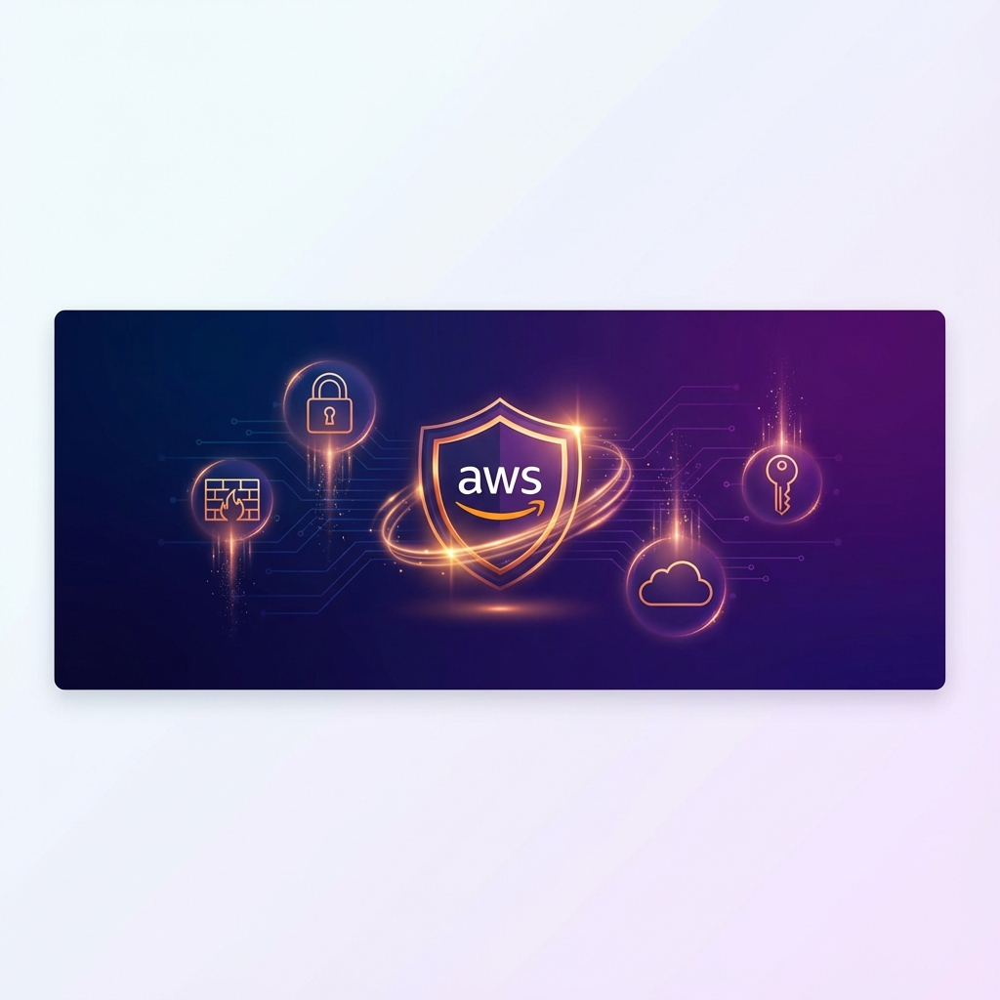
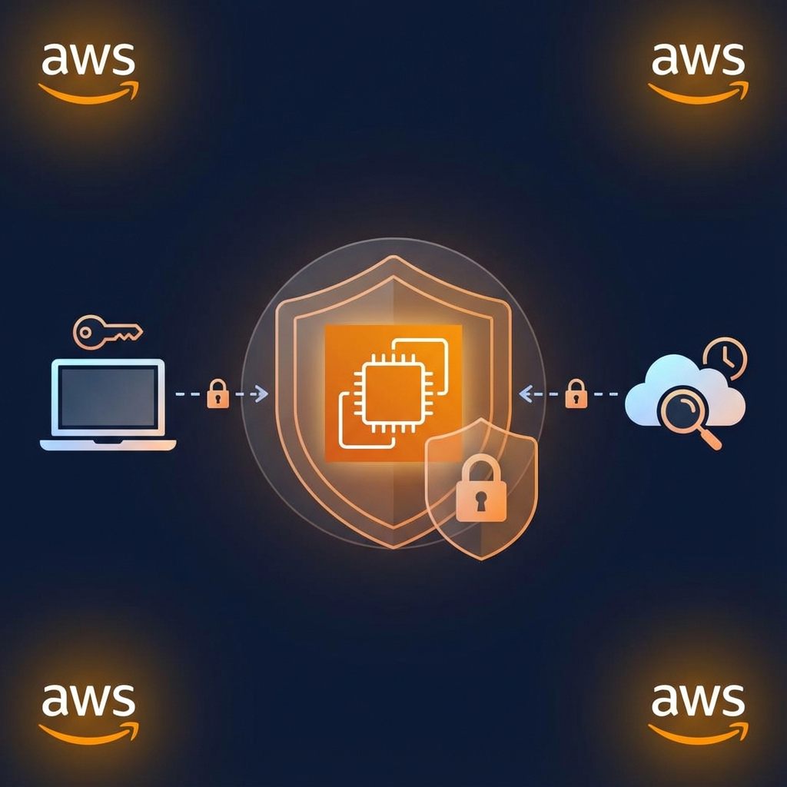
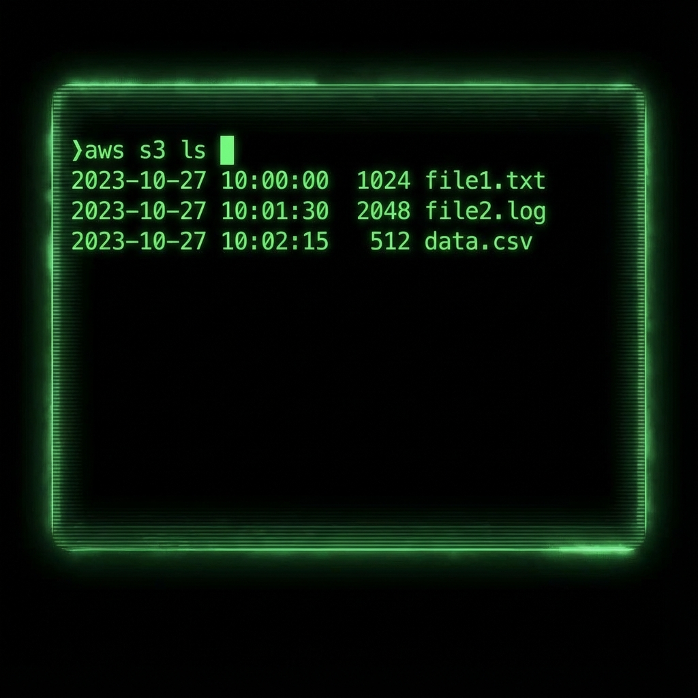

# ☁️ Project 1: Securing AWS EC2 Instances

<div align="center">




**A comprehensive hands-on guide to securing AWS EC2 instances from launch to production-ready hardening**

[Overview](#-introduction) •
[Exercises](#-exercises) •
[Best Practices](#-security-checklist) •
[Resources](#-additional-resources)

</div>

---

## 📋 Table of Contents

- [Introduction](#-introduction)
- [Prerequisites](#-prerequisites)
- [Architecture Overview](#-architecture-overview)
- [Lab Setup & Tools](#%EF%B8%8F-lab-setup--tools)
- [Exercises](#-exercises)
  - [Exercise 1: Launch an EC2 Instance](#exercise-1-launch-an-ec2-instance)
  - [Exercise 2: Connect to Your EC2 Instance](#exercise-2-connect-to-your-ec2-instance)
  - [Exercise 3: Update and Secure Your Instance](#exercise-3-update-and-secure-your-instance)
  - [Exercise 4: Configure Security Groups](#exercise-4-configure-a-basic-firewall-with-security-groups)
  - [Exercise 5: Set Up CloudWatch Monitoring](#exercise-5-set-up-cloudwatch-for-monitoring)
- [Security Checklist](#-security-checklist)
- [Troubleshooting](#-troubleshooting)
- [Additional Resources](#-additional-resources)
- [Author](#-author)

---

## 📖 Introduction

In this project, you'll learn how to secure AWS EC2 instances from the ground up. We'll cover essential concepts including setting up security groups, configuring key pairs for SSH access, hardening the operating system, and implementing monitoring best practices.

| Attribute | Details |
|-----------|---------|
| ⏱️ **Time to Complete** | 60-90 minutes |
| 📚 **Difficulty Level** | Beginner |
| 💰 **AWS Cost** | Free Tier Eligible |
| 🔧 **Services Used** | EC2, Security Groups, CloudWatch |
| 🎯 **Skills Gained** | Instance hardening, SSH security, Network security, Monitoring |

---

## 📋 Prerequisites

Before starting this project, ensure you have:

| Requirement | Description | Status |
|-------------|-------------|--------|
| ☁️ **Cloud Knowledge** | Basic understanding of cloud computing concepts | Required |
| 🔐 **AWS Account** | AWS account (free tier available) | Required |
| 💻 **CLI Knowledge** | Basic knowledge of command-line interface | Required |
| 🌐 **Internet Access** | Stable internet connection | Required |

---

## 🏗️ Architecture Overview

<div align="center">



*Figure 1: EC2 Security Architecture - Security Groups, SSH Key Access, and CloudWatch Monitoring*

</div>

This architecture shows:
- **EC2 Instance** at the center, protected by Security Groups
- **SSH Key-based Access** from authorized workstations only
- **CloudWatch Monitoring** for real-time alerting
- **Network Isolation** through proper Security Group configuration

---

## 🛠️ Lab Setup & Tools

### Required Tools Installation

| Tool | Purpose | Installation |
|------|---------|--------------|
| **AWS Account** | Access to cloud resources | [Sign up free](https://aws.amazon.com/free/) |
| **AWS CLI** | Command-line cloud management | [Installation Guide](https://docs.aws.amazon.com/cli/latest/userguide/getting-started-install.html) |
| **SSH Client** | Secure remote connection | Built-in (Linux/Mac) or [PuTTY](https://www.putty.org/) (Windows) |

### Verify AWS CLI Installation

```bash
# Check AWS CLI version
aws --version

# Expected output
aws-cli/2.x.x Python/3.x.x ...
```

<div align="center">



*Figure 2: AWS CLI Terminal Interface*

</div>

---

## 🎯 Exercises

### Exercise 1: Launch an EC2 Instance

<details>
<summary>📝 <strong>Learning Objectives</strong></summary>

- Understand EC2 instance types and AMIs
- Learn to configure security groups during launch
- Create and manage SSH key pairs

</details>

#### Steps

| Step | Action | Details |
|------|--------|---------|
| 1 | Log in to [AWS Management Console](https://aws.amazon.com/console/) | Use your AWS credentials |
| 2 | Navigate to EC2 Dashboard | Services → Compute → EC2 |
| 3 | Click "Launch Instance" | Orange button on dashboard |
| 4 | Choose AMI | **Amazon Linux 2023 AMI** (Free tier eligible) |
| 5 | Select instance type | **t2.micro** (Free tier eligible) |
| 6 | Configure instance details | Leave default settings |
| 7 | Add storage | Default 8 GB gp3 is sufficient |
| 8 | Add tags | `Name: SecureEC2` (optional but recommended) |

#### Security Group Configuration

```
┌─────────────────────────────────────────────────────────────┐
│                    Security Group Rules                      │
├─────────────┬──────────┬─────────────┬──────────────────────┤
│    Type     │  Protocol│    Port     │       Source         │
├─────────────┼──────────┼─────────────┼──────────────────────┤
│    SSH      │   TCP    │     22      │  Your IP only        │
│             │          │             │  (e.g., 203.0.113.0/32)│
└─────────────┴──────────┴─────────────┴──────────────────────┘
```

> ⚠️ **Security Warning:** Never allow SSH from `0.0.0.0/0` (anywhere) in production!

| Step | Action |
|------|--------|
| 9 | Configure Security Group | Create new → Allow SSH from **your IP only** |
| 10 | Review and Launch | Verify all settings |
| 11 | Create Key Pair | Name: `my-secure-key` → Download `.pem` file |
| 12 | Launch Instance | Click "Launch Instances" |

#### ✅ Expected Output

```
✓ Instance launched successfully
✓ Instance ID: i-0abc123def456789
✓ Instance State: running
✓ Public IPv4: 54.x.x.x
```

---

### Exercise 2: Connect to Your EC2 Instance


#### Steps

**1. Set correct permissions for key file:**

```bash
# Linux/Mac
chmod 400 my-secure-key.pem

# Windows (PowerShell)
icacls my-secure-key.pem /inheritance:r
icacls my-secure-key.pem /grant:r "$($env:USERNAME):(R)"
```

**2. Connect via SSH:**

```bash
ssh -i "my-secure-key.pem" ec2-user@<your-instance-public-dns>
```

> 💡 **Tip:** Replace `<your-instance-public-dns>` with something like:
> `ec2-54-123-45-67.compute-1.amazonaws.com`

#### ✅ Expected Output

```
The authenticity of host '...' can't be established.
ECDSA key fingerprint is SHA256:...
Are you sure you want to continue connecting (yes/no)? yes

       __|  __|_  )
       _|  (     /   Amazon Linux 2023
      ___|\___|___|

[ec2-user@ip-172-31-xx-xx ~]$
```

<details>
<summary>🔧 <strong>Troubleshooting Connection Issues</strong></summary>

| Issue | Solution |
|-------|----------|
| Permission denied | Verify key file permissions (`chmod 400`) |
| Connection timeout | Check Security Group allows your IP |
| Host key verification failed | Remove old entry from `~/.ssh/known_hosts` |

</details>

---

### Exercise 3: Update and Secure Your Instance

#### Step 1: Update System Packages

```bash
# Update package list and install security updates
sudo yum update -y && sudo yum upgrade -y
```

#### Step 2: Create a Non-Root User

```bash
# Create new user
sudo adduser secadmin

# Grant sudo privileges
sudo usermod -aG wheel secadmin

# Set up SSH for new user
sudo mkdir -p /home/secadmin/.ssh
sudo cp ~/.ssh/authorized_keys /home/secadmin/.ssh/
sudo chown -R secadmin:secadmin /home/secadmin/.ssh
sudo chmod 700 /home/secadmin/.ssh
sudo chmod 600 /home/secadmin/.ssh/authorized_keys
```

#### Step 3: Harden SSH Configuration

```bash
# Edit SSH configuration
sudo vi /etc/ssh/sshd_config
```

Make the following changes:

```bash
# ══════════════════════════════════════════════════════════
# SSH Hardening Configuration
# ══════════════════════════════════════════════════════════

# Disable root login
PermitRootLogin no

# Disable password authentication (key-only)
PasswordAuthentication no

# Disable empty passwords
PermitEmptyPasswords no

# Use SSH Protocol 2 only
Protocol 2

# Set idle timeout (5 minutes)
ClientAliveInterval 300
ClientAliveCountMax 0

# Limit authentication attempts
MaxAuthTries 3
```

```bash
# Restart SSH service to apply changes
sudo systemctl restart sshd
```

> ⚠️ **Warning:** Before closing your current session, test SSH access in a new terminal window to avoid locking yourself out!

#### ✅ Expected Output

```
✓ System packages updated
✓ New user 'secadmin' created with sudo privileges
✓ SSH hardened with key-based authentication only
✓ Root login disabled
```

---

### Exercise 4: Configure a Basic Firewall with Security Groups

#### AWS Console Steps

| Step | Action |
|------|--------|
| 1 | Navigate to **EC2 Dashboard** → Select your instance |
| 2 | Click **Security** tab → Click on Security Group link |
| 3 | Click **Edit inbound rules** |
| 4 | Remove any `0.0.0.0/0` SSH rules |
| 5 | Add rule: SSH from **your specific IP** only |
| 6 | Click **Save rules** |

#### Recommended Security Group Configuration

```
┌──────────────────────────────────────────────────────────────────┐
│                     Inbound Rules                                 │
├──────────┬──────────┬────────┬────────────────────┬──────────────┤
│   Type   │ Protocol │  Port  │      Source        │ Description  │
├──────────┼──────────┼────────┼────────────────────┼──────────────┤
│   SSH    │   TCP    │   22   │ YOUR_IP/32         │ Admin SSH    │
└──────────┴──────────┴────────┴────────────────────┴──────────────┘

┌──────────────────────────────────────────────────────────────────┐
│                     Outbound Rules                                │
├──────────┬──────────┬────────┬────────────────────┬──────────────┤
│   Type   │ Protocol │  Port  │    Destination     │ Description  │
├──────────┼──────────┼────────┼────────────────────┼──────────────┤
│   All    │   All    │  All   │ 0.0.0.0/0          │ Allow all    │
│ traffic  │          │        │                    │ outbound     │
└──────────┴──────────┴────────┴────────────────────┴──────────────┘
```

#### ✅ Expected Output

```
✓ Inbound SSH restricted to your IP only
✓ No open ports to 0.0.0.0/0
✓ Outbound traffic allowed for updates
```

---

### Exercise 5: Set Up CloudWatch for Monitoring

#### Steps

| Step | Action | Details |
|------|--------|---------|
| 1 | Navigate to **CloudWatch Dashboard** | Services → Management → CloudWatch |
| 2 | Click **Alarms** → **Create Alarm** | In left sidebar |
| 3 | Click **Select metric** | Choose EC2 metrics |
| 4 | Select your instance | Per-Instance Metrics → CPUUtilization |
| 5 | Configure threshold | See configuration below |
| 6 | Set up notification | Create SNS topic with your email |
| 7 | Name and create alarm | Name: `EC2-High-CPU-Alert` |

#### Alarm Configuration

```yaml
Metric Configuration:
  Namespace: AWS/EC2
  MetricName: CPUUtilization
  Statistic: Average
  Period: 300 seconds (5 minutes)

Threshold:
  Type: Static
  Condition: Greater than 80
  
Actions:
  Alarm State: Send email notification
  OK State: Send recovery notification
```

#### Additional Recommended Alarms

| Alarm | Metric | Threshold | Purpose |
|-------|--------|-----------|---------|
| High CPU | CPUUtilization | > 80% for 5 min | Performance monitoring |
| Status Check | StatusCheckFailed | >= 1 | Instance health |
| Network In | NetworkIn | > 50 MB for 5 min | Unusual traffic detection |

#### ✅ Expected Output

```
✓ CloudWatch alarm created: EC2-High-CPU-Alert
✓ SNS topic created for notifications
✓ Email subscription confirmed
✓ Alarm state: OK
```

---

## ✅ Security Checklist

Use this checklist to verify all security measures are in place:

| Category | Security Control | Status |
|----------|-----------------|--------|
| **Identity** | Non-root user created | ⬜ |
| **Identity** | SSH key-based auth only | ⬜ |
| **Identity** | Root login disabled | ⬜ |
| **Network** | Security Group restricts SSH to your IP | ⬜ |
| **Network** | No 0.0.0.0/0 inbound rules | ⬜ |
| **System** | System packages updated | ⬜ |
| **System** | Auto-updates configured | ⬜ |
| **Monitoring** | CloudWatch alarm configured | ⬜ |
| **Monitoring** | Email notifications enabled | ⬜ |

---

## 🔧 Troubleshooting

### Common Issues & Solutions

<details>
<summary><strong>❌ SSH Connection Timeout</strong></summary>

**Possible Causes:**
1. Security Group doesn't allow your IP
2. Instance is not running
3. Wrong port or IP address

**Solution:**
```bash
# Check your public IP
curl ifconfig.me

# Verify it matches Security Group rule
```
</details>

<details>
<summary><strong>❌ Permission Denied (publickey)</strong></summary>

**Possible Causes:**
1. Wrong key file
2. Incorrect key permissions
3. Wrong username

**Solution:**
```bash
# Correct permissions
chmod 400 your-key.pem

# Use correct username (ec2-user for Amazon Linux)
ssh -i your-key.pem ec2-user@<ip>
```
</details>

<details>
<summary><strong>❌ Locked Out After SSH Hardening</strong></summary>

**Solution:**
1. Stop the instance
2. Detach root volume
3. Attach to another instance
4. Mount and edit `/etc/ssh/sshd_config`
5. Reattach to original instance
6. Start instance
</details>

---

## 📚 Additional Resources

| Resource | Description |
|----------|-------------|
| 📖 [EC2 Security Best Practices](https://docs.aws.amazon.com/AWSEC2/latest/UserGuide/ec2-security.html) | Official AWS security guide |
| 🔐 [Security Groups](https://docs.aws.amazon.com/vpc/latest/userguide/vpc-security-groups.html) | VPC security documentation |
| 📊 [CloudWatch User Guide](https://docs.aws.amazon.com/AmazonCloudWatch/latest/monitoring/) | Monitoring documentation |
| 🛡️ [CIS Amazon Linux Benchmark](https://www.cisecurity.org/benchmark/amazon_linux) | Hardening standards |
| 🔧 [AWS CLI Reference](https://docs.aws.amazon.com/cli/latest/reference/ec2/) | EC2 CLI commands |

---

## 🎓 Conclusion

By completing these exercises, you have successfully:

- [x] Launched an EC2 instance with proper security configuration
- [x] Connected securely using SSH key-based authentication
- [x] Hardened the operating system and SSH configuration
- [x] Configured Security Groups as a network firewall
- [x] Set up CloudWatch monitoring and alerting

These are essential skills for maintaining the security and performance of your cloud infrastructure.

---

## 👤 Author

<div align="center">


**Amresh Kumar**

[](https://github.com/Ak-cybe)
[](https://www.linkedin.com/in/amresh-kumar-7b5ab8326/)

*Cloud Security Enthusiast | AWS Practitioner*

</div>

---

## 📄 License

This project is licensed under the MIT License - see the [LICENSE](LICENSE) file for details.

---

<div align="center">

**⭐ If this project helped you learn EC2 security, please star the repository!**

[](https://github.com/Ak-cybe/AWS-Security-Projects)

---

Made with ❤️ for the Cloud Security Community

[🔝 Back to Top](#️-project-1-securing-aws-ec2-instances)

</div>
