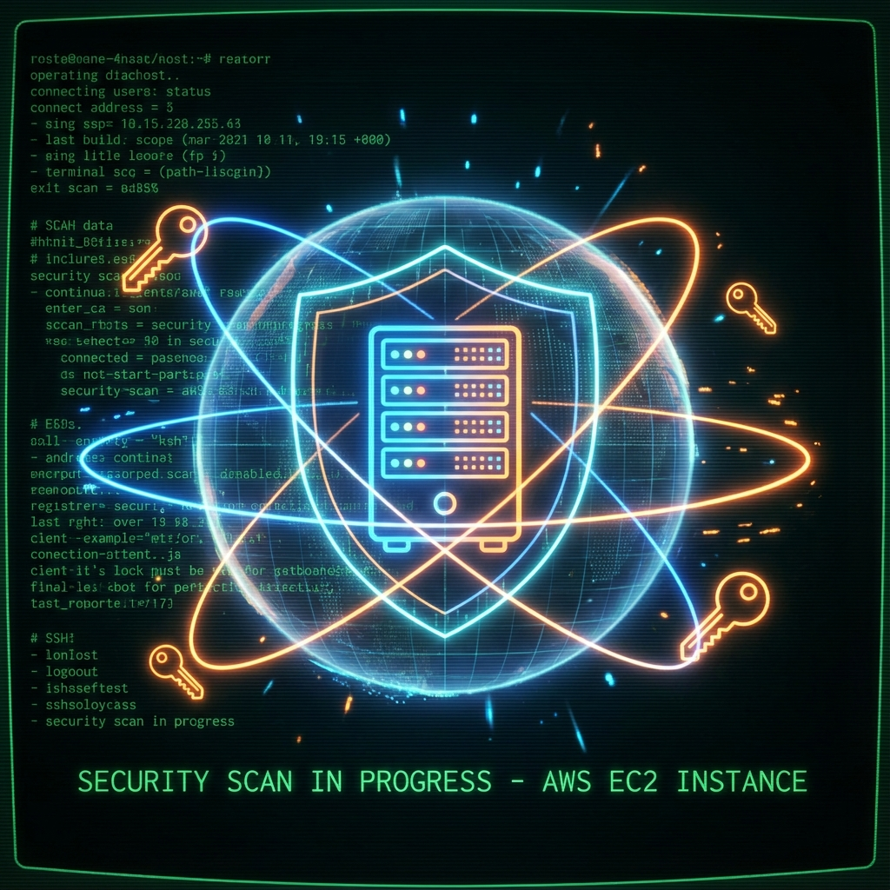

# ☁️ Project 1: Securing AWS EC2 Instances

<div align="center">




**A comprehensive hands-on guide to securing AWS EC2 instances from launch to production-ready hardening**

[Overview](#-introduction) •
[Exercises](#-exercises) •
[Best Practices](#-security-checklist) •
[Resources](#-additional-resources)

</div>

---

## 📋 Table of Contents

- [Introduction](#-introduction)
- [Prerequisites](#-prerequisites)
- [Architecture Overview](#-architecture-overview)
- [Lab Setup & Tools](#️-lab-setup--tools)
- [Exercises](#-exercises)
- [Security Checklist](#-security-checklist)
- [Troubleshooting](#-troubleshooting)
- [Additional Resources](#-additional-resources)

---

## 📖 Introduction

In this project, you'll learn how to secure AWS EC2 instances from the ground up. We'll cover essential concepts including setting up security groups, configuring key pairs for SSH access, hardening the operating system, and implementing monitoring best practices.

| Attribute | Details |
|-----------|---------|
| ⏱️ **Time to Complete** | 60-90 minutes |
| 📚 **Difficulty Level** | Beginner |
| 💰 **AWS Cost** | Free Tier Eligible |
| 🔧 **Services Used** | EC2, Security Groups, CloudWatch |

---

## 📋 Prerequisites

| Requirement | Description | Status |
|-------------|-------------|--------|
| ☁️ **Cloud Knowledge** | Basic understanding of cloud computing | Required |
| 🔐 **AWS Account** | AWS account (free tier available) | Required |
| 💻 **CLI Knowledge** | Basic command-line interface | Required |

---

## 🏗️ Architecture Overview

<div align="center">


*EC2 Security Architecture - Security Groups, SSH Key Access, CloudWatch Monitoring*

</div>

---

## 🛠️ Lab Setup & Tools

| Tool | Purpose | Installation |
|------|---------|--------------|
| **AWS Account** | Cloud resources | [Sign up free](https://aws.amazon.com/free/) |
| **AWS CLI** | Command-line management | [Installation Guide](https://docs.aws.amazon.com/cli/latest/userguide/getting-started-install.html) |
| **SSH Client** | Secure connection | Built-in (Linux/Mac) or [PuTTY](https://www.putty.org/) |

```bash
# Verify AWS CLI installation
aws --version
```

---

## 🎯 Exercises

### Exercise 1: Launch an EC2 Instance

| Step | Action |
|------|--------|
| 1 | Log in to [AWS Management Console](https://aws.amazon.com/console/) |
| 2 | Navigate to EC2 Dashboard → Launch Instance |
| 3 | Choose **Amazon Linux 2023 AMI** (Free tier) |
| 4 | Select **t2.micro** instance type |
| 5 | Configure Security Group (SSH from your IP only) |
| 6 | Create key pair → Download `.pem` file |
| 7 | Launch Instance |

> ⚠️ **Security Warning:** Never allow SSH from `0.0.0.0/0` in production!

---

### Exercise 2: Connect to Your EC2 Instance

```bash
# Set correct permissions (Linux/Mac)
chmod 400 my-secure-key.pem

# Connect via SSH
ssh -i "my-secure-key.pem" ec2-user@<your-instance-public-dns>
```

**Windows (PowerShell):**
```powershell
icacls my-secure-key.pem /inheritance:r
icacls my-secure-key.pem /grant:r "$($env:USERNAME):(R)"
```

---

### Exercise 3: Update and Secure Your Instance

```bash
# Update system packages
sudo yum update -y && sudo yum upgrade -y

# Create non-root user
sudo adduser secadmin
sudo usermod -aG wheel secadmin
```

**SSH Hardening (`/etc/ssh/sshd_config`):**

```bash
PermitRootLogin no
PasswordAuthentication no
MaxAuthTries 3
ClientAliveInterval 300
```

```bash
# Apply changes
sudo systemctl restart sshd
```

---

### Exercise 4: Configure Security Groups

| Type | Protocol | Port | Source |
|------|----------|------|--------|
| SSH | TCP | 22 | Your IP/32 |

> ❌ Remove any `0.0.0.0/0` inbound rules!

---

### Exercise 5: Set Up CloudWatch Monitoring

| Setting | Value |
|---------|-------|
| Metric | CPUUtilization |
| Threshold | > 80% for 5 min |
| Action | Send email notification |

---

## ✅ Security Checklist

| Security Control | Status |
|-----------------|--------|
| Non-root user created | ⬜ |
| SSH key-based auth only | ⬜ |
| Root login disabled | ⬜ |
| Security Group restricts SSH to your IP | ⬜ |
| System packages updated | ⬜ |
| CloudWatch alarm configured | ⬜ |

---

## 🔧 Troubleshooting

<details>
<summary><strong>❌ SSH Connection Timeout</strong></summary>

Check Security Group allows your IP:
```bash
curl ifconfig.me  # Get your public IP
```
</details>

<details>
<summary><strong>❌ Permission Denied (publickey)</strong></summary>

```bash
chmod 400 your-key.pem
ssh -i your-key.pem ec2-user@<ip>
```
</details>

---

## 📚 Additional Resources

| Resource | Link |
|----------|------|
| EC2 Security Best Practices | [AWS Docs](https://docs.aws.amazon.com/AWSEC2/latest/UserGuide/ec2-security.html) |
| Security Groups | [VPC Docs](https://docs.aws.amazon.com/vpc/latest/userguide/vpc-security-groups.html) |
| CloudWatch | [Monitoring Docs](https://docs.aws.amazon.com/AmazonCloudWatch/latest/monitoring/) |

---

## 👤 Author

<div align="center">

**Amresh Kumar**

[](https://github.com/Ak-cybe)
[](https://www.linkedin.com/in/amresh-kumar-7b5ab8326/)

</div>

---

<div align="center">

**⭐ Star this repo if it helped you!**

[🔝 Back to Top](#️-project-1-securing-aws-ec2-instances)

</div>
