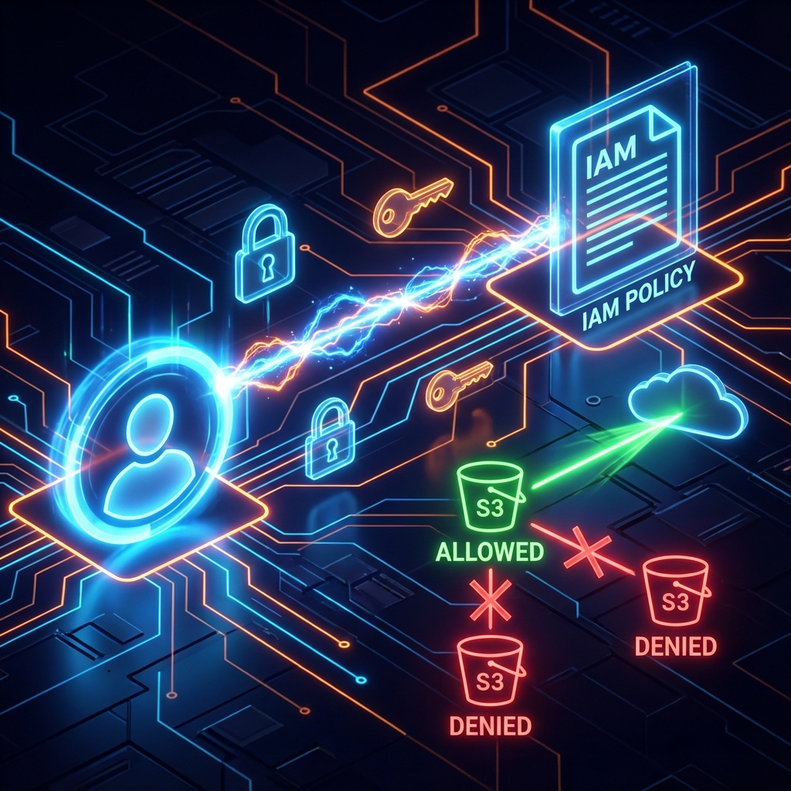

# 🛡️ Project 2: Implementing Least Privilege with AWS IAM

<div align="center">




**A hands-on guide to implementing the Principle of Least Privilege using AWS IAM custom policies**

[Overview](#-project-overview) •
[Implementation](#-step-by-step-implementation) •
[Testing](#phase-3-cli-configuration--testing) •
[Best Practices](#-security-best-practices-implemented)

</div>

---

## 📋 Table of Contents

- [Project Overview](#-project-overview)
- [Prerequisites](#-prerequisites)
- [Objectives](#-objectives)
- [Architecture Diagram](#-architecture-diagram)
- [Step-by-Step Implementation](#-step-by-step-implementation)
- [Use Case Scenarios](#-use-case-scenarios)
- [Security Best Practices](#-security-best-practices-implemented)
- [Learning Outcomes](#-learning-outcomes)

---

## 📖 Project Overview

This project demonstrates the implementation of the **Principle of Least Privilege** in AWS. The goal was to move away from using root accounts by creating a specialized IAM user with strictly limited permissions.

| Attribute | Details |
|-----------|---------|
| ⏱️ **Time to Complete** | 30-45 minutes |
| 📚 **Difficulty Level** | Beginner-Intermediate |
| 💰 **AWS Cost** | Free Tier Eligible |
| 🔧 **Services Used** | IAM, S3, AWS CLI |

---

## 📋 Prerequisites

- [ ] AWS Account with Administrator access
- [ ] AWS CLI installed ([Guide](https://docs.aws.amazon.com/cli/latest/userguide/getting-started-install.html))
- [ ] Basic understanding of JSON syntax
- [ ] An existing S3 bucket for testing

---

## 🎯 Objectives

| Objective | Description |
|-----------|-------------|
| 🆔 **Identity Management** | Create programmatic user (`s3-read-user`) |
| 🔒 **Access Control** | Custom IAM policy with JSON |
| ✅ **Verification** | Test permissions with AWS CLI |

---

## 🏗️ Architecture Diagram

<div align="center">


*IAM User with Custom Policy - Only allowed S3 bucket access, others denied*

</div>

---

## 🛠️ Step-by-Step Implementation

### Phase 1: IAM User Configuration

1. Navigate to **IAM Dashboard** → **Users** → **Add user**
2. Configure:

| Setting | Value |
|---------|-------|
| **Username** | `s3-read-user` |
| **Access Type** | Programmatic Access |

> ⚠️ Save the Access Key ID and Secret Access Key securely!

---

### Phase 2: Defining the Security Policy (JSON)

```json
{
    "Version": "2012-10-17",
    "Statement": [
        {
            "Sid": "AllowS3ReadAccess",
            "Effect": "Allow",
            "Action": [
                "s3:ListBucket",
                "s3:GetObject"
            ],
            "Resource": [
                "arn:aws:s3:::my-secure-bucket",
                "arn:aws:s3:::my-secure-bucket/*"
            ]
        }
    ]
}
```

| Component | Purpose |
|-----------|---------|
| `s3:ListBucket` | List objects in bucket |
| `s3:GetObject` | Download/read files |
| **Resource** | Locked to specific bucket only |

---

### Phase 3: CLI Configuration & Testing

**Configure AWS CLI:**

```bash
aws configure --profile s3-user
# Enter: Access Key ID, Secret Key, us-east-1, json
```

**Test Allowed Access:**

```bash
aws s3 ls s3://my-secure-bucket --profile s3-user
# ✅ Success: Lists files
```

**Test Denied Access:**

```bash
aws s3 ls s3://other-bucket --profile s3-user
# ❌ Access Denied (as expected!)
```

---

## 🚀 Use Case Scenarios

| Use Case | Description |
|----------|-------------|
| 🔌 **Third-party Apps** | Read-only access to specific logs |
| 👨‍💻 **Developers** | Fetch assets without admin rights |
| ⚙️ **Microservices** | Read configuration files only |
| 🔄 **CI/CD Pipelines** | Read access to artifact buckets |

---

## 🔐 Security Best Practices Implemented

| Practice | Status |
|----------|--------|
| Least Privilege (explicit allowances only) | ✅ |
| Resource constraints (specific ARNs) | ✅ |
| No hardcoded credentials | ✅ |
| Separation of duties | ✅ |

---

## ⚠️ Credential Management

| Method | Best For | Security |
|--------|----------|----------|
| **AWS CLI Profiles** | Dev workstations | ⭐⭐⭐ |
| **IAM Roles** | EC2/Lambda | ⭐⭐⭐⭐⭐ |
| **Secrets Manager** | Production | ⭐⭐⭐⭐⭐ |

```bash
# ❌ DON'T: Hardcode credentials
# ✅ DO: Use profiles or IAM roles
aws s3 ls --profile s3-user
```

---

## 📊 Learning Outcomes

- [x] Create IAM users with programmatic access
- [x] Write custom JSON policies
- [x] Inline vs managed policies
- [x] Test IAM permissions via CLI
- [x] Principle of Least Privilege

---

## 🔄 Future Improvements

| Enhancement | Priority |
|-------------|----------|
| 🔐 MFA Enforcement | High |
| 🎭 IAM Roles for EC2 | High |
| 🔔 CloudWatch Alerts | Medium |

---

## 📚 Resources

| Resource | Link |
|----------|------|
| IAM Best Practices | [AWS Docs](https://docs.aws.amazon.com/IAM/latest/UserGuide/best-practices.html) |
| S3 Bucket Policies | [S3 Docs](https://docs.aws.amazon.com/AmazonS3/latest/userguide/bucket-policies.html) |
| Policy Simulator | [AWS Tool](https://policysim.aws.amazon.com/) |

---

## 👤 Author

<div align="center">

**Amresh Kumar**

[](https://github.com/Ak-cybe)
[](https://www.linkedin.com/in/amresh-kumar-7b5ab8326/)

</div>

---

<div align="center">

**⭐ Star this repo if it helped you understand IAM policies!**

[🔝 Back to Top](#️-project-2-implementing-least-privilege-with-aws-iam)

</div>
